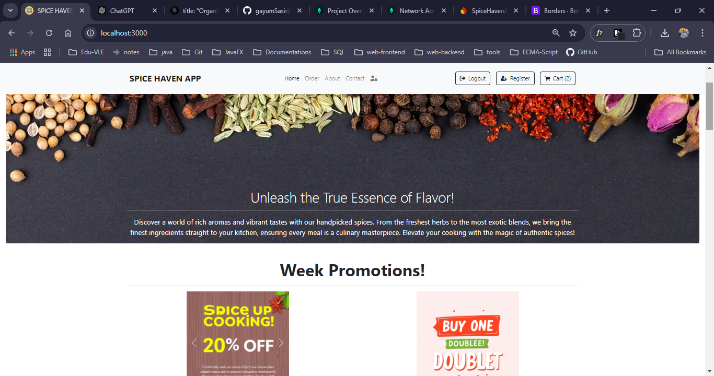
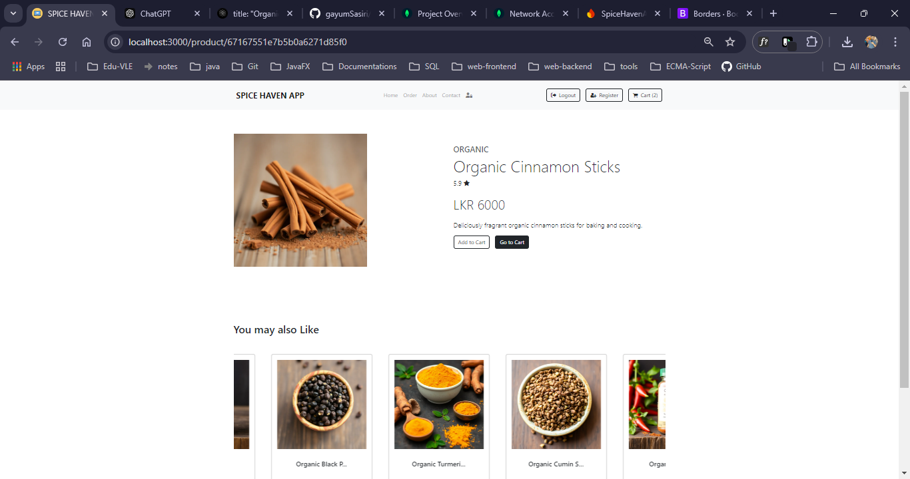
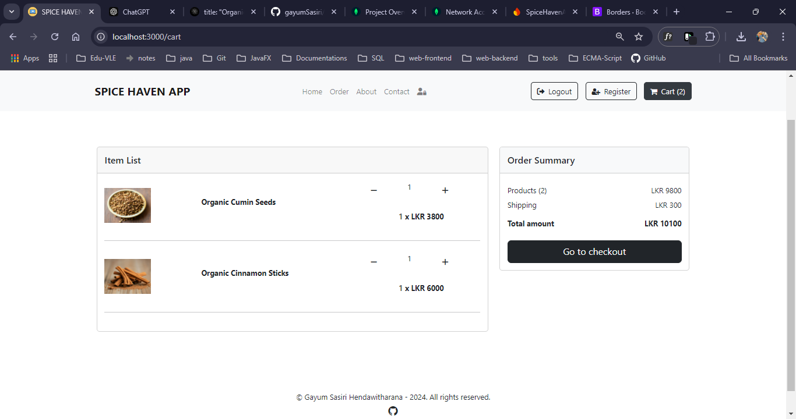

# E-commerce Application

This is a React-based e-commerce application that offers a wide range of features for both customers and sellers. It utilizes Redux for state management, React Router for navigation, and various libraries to enhance the user experience.

## Features

- **User Authentication**: Users can log in, register, and reset their passwords.
- **Product Management**: Sellers can add, update, and view their products.
- **Protected Routes**: Certain routes are accessible only to authorized users, ensuring security and privacy.
- **Shopping Cart**: Users can add products to their cart and proceed to checkout.
- **Order Management**: Users can view their past orders and order details.
- **Admin Panel**: Admins have special access to manage users and oversee platform operations.
- **Responsive Design**: The application is designed to be mobile-friendly and responsive.
- **Toast Notifications**: Users receive real-time feedback through toast notifications for actions performed.
- **Scroll to Top**: Smooth scrolling functionality for better user navigation.

## Technologies Used

- **Frontend**:
  - React: A JavaScript library for building user interfaces.
  - React Router: A library for routing in React applications.
  - Redux Toolkit: A powerful tool for managing application state.
  - Axios: A promise-based HTTP client for making API requests.
  - Bootstrap: A CSS framework for responsive design.
  - Font Awesome: Icons for user interface enhancement.
  - React Hot Toast: For displaying notifications.

- **Development Tools**:
  - ESLint: A static code analysis tool for identifying problematic patterns in JavaScript code.
  - React Scripts: Scripts for setting up and running the React application.

## Installation

To run this project locally, follow these steps:

1. Clone the repository:
   ```bash
   git clone https://github.com/gayumSasiri/Spice_Haven_E_Commerce_Frontend.git
   cd ecommerce
   ```
2. Install dependencies:
   ```bash
   npm install
   ```
3. Start the application:
   ```bash
   npm start
   ```
## Screenshots




## Usage

Visit `http://localhost:3000` in your web browser to access the application.

## License

This project is licensed under the MIT License - see the [LICENSE](LICENSE) file for details.

## Author

Gayum Sasiri Hendawithrana
